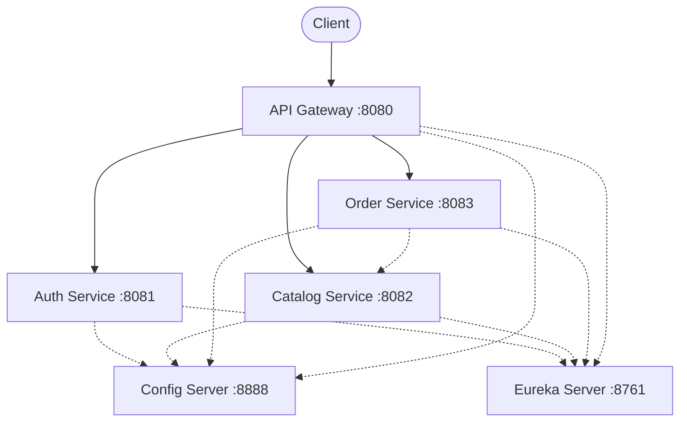
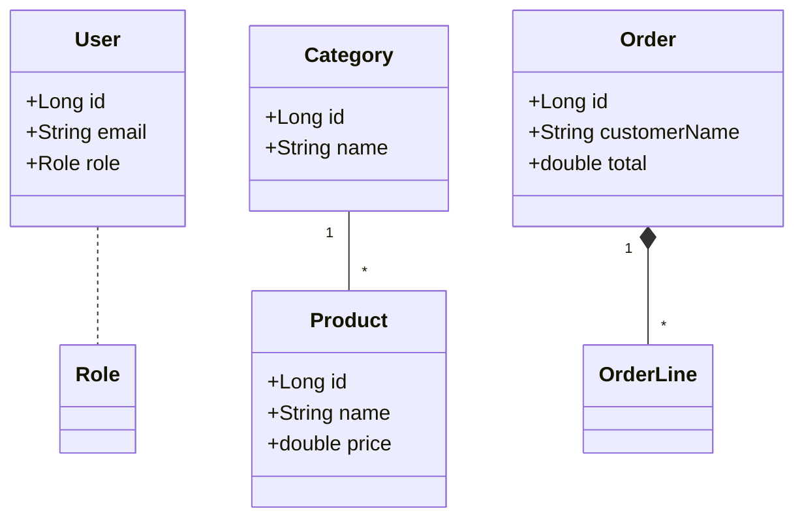

# Mini Projet Microservices -

A robust, scalable e-commerce backend built with Spring Boot Microservices. This project demonstrates a comprehensive microservices architecture including Service Discovery, API Gateway, Centralized Configuration, and JWT-based Security.

## 🏗 Architecture

The project follows a standard microservices pattern:



### UML Domain Model


## 🚀 Microservices

| Service | Port | Description |
|---------|------|-------------|
| **Discovery Server** | 8761 | Eureka Service Registry |
| **Config Server** | 8888 | Centralized Configuration Server |
| **API Gateway** | 8080 | Entry point, routing, and filtering |
| **Auth Service** | 8081 | User authentication & JWT generation |
| **Catalog Service** | 8082 | Product & Category management |
| **Order Service** | 8083 | Order processing |

## 🛠 Prerequisites

- Java 17+
- Maven 3.6+
- Docker (optional, for containerization)

## 🏁 Getting Started

### 1. Clone the repository
```bash
git clone https://github.com/your-username/mini-projet-ms.git
cd mini-projet-ms
```

### 2. Configuration
**Important**: This project uses environment variables for sensitive data.
Create a `.env` file or export the following variables before running:
```bash
export JWT_SECRET=your_secure_secret_key_here
```

### 3. Build & Run
You can run the services individually or use the provided script.

**Using the startup script:**
```bash
chmod +x run_all.sh
./run_all.sh
```

**Manual Start Order:**
1. Discovery Server
2. Config Server
3. Auth Service
4. Catalog Service
5. Order Service
6. API Gateway

## 🔌 API Usage

Import the provided Postman collection `microservices_postman_collection.json` to test the endpoints.

### Key Endpoints
- **POST** `/auth/register` - Create new account
- **POST** `/auth/token` - Login & get JWT
- **GET** `/catalog/products` - List products
- **POST** `/orders` - Place an order (Requires JWT)

## 🛡 Security

- **JWT Authentication**: Secured endpoints require a valid Bearer Token.
- **Gateway Filter**: The API Gateway validates tokens before forwarding requests.
